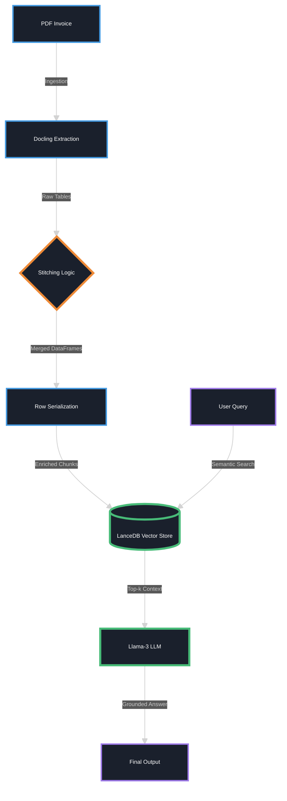

# System Architecture

## End-to-End Data Flow
The system follows a linear ETL (Extract, Transform, Load) pipeline followed by a RAG (Retrieval Augmented Generation) inference loop.

```mermaid
%%{init: {'theme':'dark', 'themeVariables': {'fontSize':'8px'}, 'flowchart':{'nodeSpacing': 120, 'rankSpacing': 100, 'padding': 20}}}%%
graph TD
    A[PDF Invoice] -->|Ingestion| B[Docling Extraction]
    B -->|Raw Tables| C{Stitching Logic}
    C -->|Merged DataFrames| D[Row Serialization]
    D -->|Enriched Chunks| E[(LanceDB Vector Store)]
    F[User Query] -->|Semantic Search| E
    E -->|Top-k Context| G[Llama-3 LLM]
    G -->|Grounded Answer| H[Final Output]
    
    style A fill:#1a202c,stroke:#4299e1,stroke-width:2px,color:#fff
    style B fill:#1a202c,stroke:#4299e1,stroke-width:2px,color:#fff
    style C fill:#1a202c,stroke:#ed8936,stroke-width:3px,color:#fff
    style D fill:#1a202c,stroke:#4299e1,stroke-width:2px,color:#fff
    style E fill:#1a202c,stroke:#48bb78,stroke-width:3px,color:#fff
    style F fill:#1a202c,stroke:#9f7aea,stroke-width:2px,color:#fff
    style G fill:#1a202c,stroke:#48bb78,stroke-width:3px,color:#fff
    style H fill:#1a202c,stroke:#9f7aea,stroke-width:2px,color:#fff
    
    classDef default fill:#1a202c,stroke:#4a5568,stroke-width:2px,color:#fff
```