# System Architecture

## End-to-End Data Flow

The system follows a linear ETL (Extract, Transform, Load) pipeline followed by a RAG (Retrieval Augmented Generation) inference loop.

### Architecture Flowchart

```mermaid
flowchart TB
    subgraph ETL["ETL Pipeline"]
        direction TB
        A[PDF Invoice]
        B[Docling Extraction]
        C{Stitching Logic}
        D[Row Serialization]
        E[(LanceDB Vector Store)]
        
        A -->|Ingestion| B
        B -->|Raw Tables| C
        C -->|Merged DataFrames| D
        D -->|Enriched Chunks| E
    end
    
    subgraph RAG["🔍 RAG Inference Loop"]
        direction TB
        F[User Query]
        G[Llama-3 LLM]
        H[Final Output]
        
        F -->|Semantic Search| G
        G -->|Grounded Answer| H
    end
    
    E -.->|Top-k Context| G
    
    style A fill:#1e40af,stroke:#3b82f6,stroke-width:3px,color:#fff
    style B fill:#1e40af,stroke:#3b82f6,stroke-width:3px,color:#fff
    style C fill:#c2410c,stroke:#f97316,stroke-width:4px,color:#fff
    style D fill:#1e40af,stroke:#3b82f6,stroke-width:3px,color:#fff
    style E fill:#15803d,stroke:#22c55e,stroke-width:4px,color:#fff
    style F fill:#6b21a8,stroke:#a855f7,stroke-width:3px,color:#fff
    style G fill:#15803d,stroke:#22c55e,stroke-width:4px,color:#fff
    style H fill:#6b21a8,stroke:#a855f7,stroke-width:3px,color:#fff
    style ETL fill:#0f172a,stroke:#475569,stroke-width:2px
    style RAG fill:#0f172a,stroke:#475569,stroke-width:2px
```

---

## Pipeline Components

### ETL Pipeline (Extract, Transform, Load)

| Stage | Component | Description | Output |
|-------|-----------|-------------|---------|
| 1️⃣ | **PDF Invoice** | Raw invoice documents | Multi-page PDFs |
| 2️⃣ | **Docling Extraction** | Parse tables and text from PDFs | Structured tables |
| 3️⃣ | **Stitching Logic** | Merge fragmented tables across pages | Complete DataFrames |
| 4️⃣ | **Row Serialization** | Convert rows to enriched text chunks | Searchable text |
| 5️⃣ | **LanceDB Vector Store** | Store embeddings for semantic retrieval | Indexed vectors |

### 🔍 RAG Inference Loop (Retrieval Augmented Generation)

| Stage | Component | Description | Output |
|-------|-----------|-------------|---------|
| 6️⃣ | **User Query** | Natural language question | Embedded query |
| 7️⃣ | **Semantic Search** | Find relevant chunks via similarity | Top-k contexts |
| 8️⃣ | **Llama-3 LLM** | Generate answer with context | Grounded response |
| 9️⃣ | **Final Output** | Return accurate answer | User response |

---